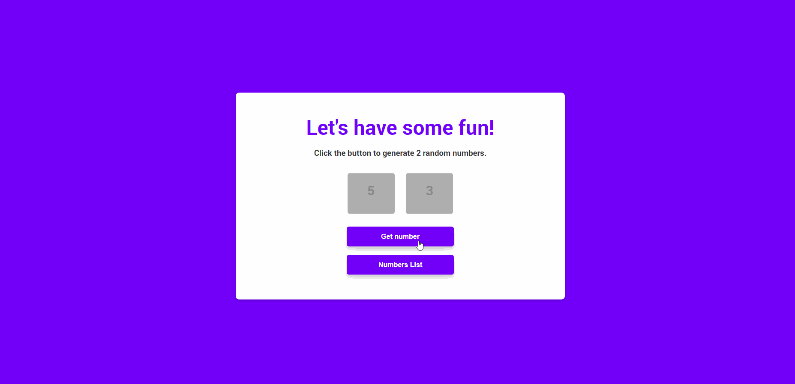

# Random Numbers Generator


## 🦉 Main information

Fullstack web application to generate 2 random numbers between 1 and 5.

Technical requirements for this challenge:

- use the JavaScript framework (for Front-end and Back-end) to build the solution
- create a place in the Front-end to display 2 numbers that will be generated
- display a button to start the generator
- display the numbers obtained by the Back-end in the place provided in the Frontend
- display a CSS animation of your choice: if the numbers are different (example 1 and 5)
- display a CSS animation of your choice: if the two digits match (example: 5 and 5)
- numbers must be generated randomly by the Back-end
- save all the results obtained in the Back-End (in memory). Don't use the database!
- retrieve from the Back-End the list of results obtained and display them on the screen

  #

The solution is built with Node.js (NODE-CACHE) et Express.js for the Back-end and React.js for Front-end.



#


## 🦊 Useful links 


### About Node.js

```
https://nodejs.org/en/about/
```

### Node-Cache - simple and fast Node.js internal caching

```
https://www.npmjs.com/package/node-cache
```

### Express.js guide

```
https://expressjs.com/en/guide/routing.html
```

### Express application generator

```
https://expressjs.com/en/starter/generator.html
```

### React.js - a JavaScript library for building user interfaces

```
https://reactjs.org/
```

## ⚡ Built With

[React](https://reactjs.org/) | [Express.js](https://expressjs.com/) | [Node.js](https://nodejs.org/en/)